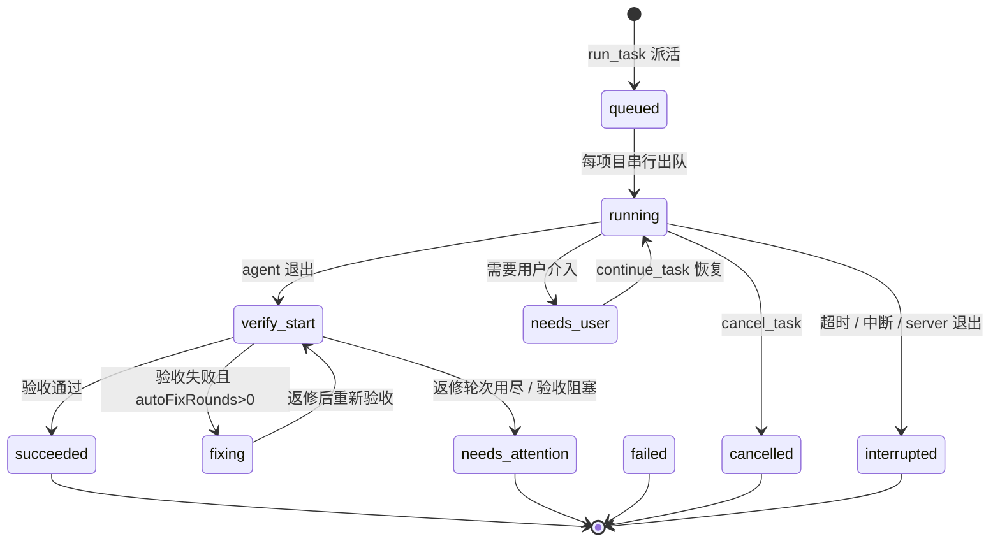

# tianshu-mcp 操作手册

> 适用版本：`0.7.1`（本仓库当前版本，尚未发布到 npm）
> 面向读者：使用天枢（Tianshu）调度外部 AI-Agent 做项目开发的人
> 最后核对：依据仓库 `package.json` / `CHANGELOG.md` / `skills\tianshu-mcp\SKILL.md` / `README.md` 逐项核对

---

## 目录

1. 它是什么
2. 五分钟上手
3. 工具速查
4. [选 agent](#4-选-agent)
5. [派活：run_task](#5-派活run_task)
6. [跟踪任务：query_task](#6-跟踪任务query_task)
7. [处理 needs_user](#7-处理-needs_user)
8. 验收报告怎么读
9. [返修：rework_task](#9-返修rework_task)
10. [取消与清理：cancel_task](#10-取消与清理cancel_task)
11. [独立复验：verify_task](#11-独立复验verify_task)
12. [视觉验收（可选）](#12-视觉验收可选)
13. 配置速查
14. 排障
15. 纪律清单

---

## 1. 它是什么

**tianshu-mcp 是一个 MCP server**。它自己不写代码，而是把外部 AI-Agent（Codex 桌面端、TraeWork、ZCode、Kimi Code、Qoder CN、Open Design——全部经 CDP 驱动其桌面 UI）当成「工人」来调度，形成 **派活 → 开发 → 客观验收 → 失败返修 → 再验收** 的闭环。

三种角色的分工：

| 角色 | 是谁 | 干什么 |
|---|---|---|
| 总指挥 | 天枢（你） | 派活、轮询、读报告、决定返修或收工，如实汇报 |
| 调度层 + 验收仪 | tianshu-mcp | 驱动 GUI、采集 git 基线、跑命令检查、解析失败原因 |
| 工人 | 外部 AI-Agent | 真正改代码、跑测试、产出变更 |

三条不变式（违反任何一条都会踩坑）：

1. **异步契约**——`run_task` 只返回一个 `taskId`，不要当同步调用等结果。
2. **验收是唯一裁判**——agent 自己说「完成」不算数，`get_task_report` 里的 `checks` 才算数。
3. **不空转**——同一个诊断只重试一次；第二次仍失败就带证据汇报，或换 agent / 缩小任务。

---

## 2. 五分钟上手

### 2.1 前置条件

| 项 | 要求 |
|---|---|
| Node.js | ≥ 20（CI 覆盖 20 / 22 / 24） |
| 包管理器 | npm |
| 操作系统 | Windows / macOS / Linux |
| Git | 可选；验收的基线分析在 git 仓库内更完整 |
| 目标 agent | 已安装并登录对应桌面端（Codex / ZCode / TraeWork / Kimi Code / Qoder CN / Open Design） |

数据目录默认 `~/.tianshu-mcp`，可用环境变量 `TIANSHU_MCP_HOME` 覆盖，首次启动自动创建。

### 2.2 安装

三种方式任选：

```bash
# A. 免安装直接拉起（npm 已发布版本）
npx -y tianshu-mcp

# B. 全局安装
npm install -g tianshu-mcp

# C. 从源码构建（用当前仓库 0.7.1）
git clone https://github.com/lanlan0811/tianshu-mcp.git
cd tianshu-mcp
npm ci
npm run build        # sync-version + tsc → dist/
npm test             # 可选：跑测试套件确认环境就绪
```

### 2.3 接入天枢

天枢「设置 → MCP 服务器 → 添加」，传输方式选 **stdio（本地进程）**：

| 字段 | npm 分发 | 本地开发（用本仓库） |
|---|---|---|
| 服务器 ID | `tianshu-mcp` | `tianshu-mcp` |
| 传输方式 | `stdio（本地进程）` | `stdio（本地进程）` |
| 命令 | `npx` | `node` |
| 参数 | `-y tianshu-mcp` | `D:/Trae项目/tianshu-mcp/dist/index.js` |

要点：

- **服务器 ID 即工具前缀**。填 `tianshu-mcp` 后，工具名形如 `mcp__tianshu-mcp__run_task`。
- **参数按空格分隔，不要加引号**；本地开发模式要把路径换成真实绝对路径。
- 界面没有环境变量输入框时，改用 `config.json` 方式（见 [§13.3](#133-server-级配置configjson)）设置 `TIANSHU_MCP_HOME`。
- 连接成功即完成，**新开会话**才能看到 11 个工具。

### 2.4 确认连通，派第一个任务

```text
步骤 1  get_profiles
        → 看目标 agent 是否 [PASS] 可用（关注 profileStatus 与探测来源）
        → 不可用就转达用户，不要硬试

步骤 2  run_task(
          projectPath = "D:/repo/my-app",
          agentId     = "codex",
          model       = "<面板里的模型名>",
          task        = "<任务书，见 §5.1>",
          autoVerify  = true,
          autoFixRounds = 2,
          idempotencyKey = "my-app-首次实现-20260928"
        )
        → 秒回 taskId

步骤 3  query_task(taskId)  每 5–10 秒轮询一次，直到终态
        → needs_user      → 按 §7 处理
        → failed/needs_attention → 按 §9 返修
        → succeeded       → 按 §8 读报告并向用户汇报
```

> `model` 必须是**界面上真实存在的模型名**，文档里的示例名一律不可当真。写错会在发送前以 `model_unavailable` 失败，并回显当前可见候选。

---

## 3. 工具速查

11 个工具，按能力分三类：

| 工具 | 能力 / 审批 | 作用 |
|---|---|---|
| `run_task` | write + 审批 | 派活给外部 agent，**异步**返回 `taskId` |
| `continue_task` | write + 审批 | 恢复 `needs_user` 的任务（原会话） |
| `query_task` | read | 轮询状态 / 进度 / 日志尾 / 最近事件 |
| `list_tasks` | read | 查历史任务 |
| `get_task_report` | read | 读某轮验收报告 Markdown 全文 |
| `cancel_task` | write + 审批 | 取消运行中任务；对终态 GUI 任务兼作人工确认入口 |
| `verify_task` | execute（不改源码、免审批） | 对任务或任意项目独立验收 |
| `rework_task` | write + 审批 | 手动返修：终态任务重新入队续跑 |
| `get_profiles` | read | 看当前机器实际探测结果 |
| `prepare_visual_baseline` | write + 审批 | 生成视觉基准**候选** |
| `approve_visual_baseline` | write + 审批 | 用户授权后批准候选，写入正式基准 |

**返回格式**：除两种情况外，结果都是「人类可读文本 + `---tianshu-mcp-meta---` JSON 块」。

不带 meta 块的三类：`get_task_report` 成功时返回报告原文；两个视觉基准工具成功时返回 JSON 原文；**任何工具的错误结果**都只有 `Error: …` 文本。

### 何时不要用

- 小改动、纯问答、只读分析——直接做，不要为它开任务。
- 工具面里看不到 `mcp__tianshu-mcp__*`——先按 [§2.3](#23-接入天枢) 接入，**不要空转或假装调用**。
- `get_profiles` 报 `[FAIL] 不可用`——如实转达用户，不要改路径硬试。

---

## 4. 选 agent

内置 agent 全部是 **GUI 驱动**（CDP 控制桌面端），不是 CLI。默认 `agentId` 取项目登记值，未登记时是 `codex`。

### 4.1 参数兼容矩阵（传错即报错，不会静默忽略）

| 参数 | codex | zcode | traework | kimicode | qoder | opendesign |
|---|---|---|---|---|---|---|
| `projectPath` | 必填 | **可省略** | 必填 | 必填 | 必填 | 必填 |
| `model` | **必填**（面板名） | **必填**（`供应商/模型`） | 可选 | **必填**（界面名） | 可选 | **必填**（界面名） |
| `modelSource` | ✗ | ✗ | ✗ | ✗ | 可选 | ✗ |
| `reasoningLevel` | `低/中/高` | ✗ | ✗ | `低/low`、`高/high`、`max`、`on`、`off` | `低/中/高/极高/最大/关闭思考` | ✗ |
| `mode` | ✗ | ✗ | **唯一支持**（Work/Code/Design） | ✗ | ✗ | ✗ |
| `planDoc` | 可选 | ✗ | ✗ | ✗ | **必填且必须可读** | ✗ |
| `designSystem` | 可选（**目录路径**） | ✗ | ✗ | ✗ | ✗ | 可选（**设计系统名**，如 `Claude`） |
| `designDirection` | ✗ | ✗ | ✗ | ✗ | ✗ | **必填**（原型/文档/网站复刻） |
| `allowCreateProject` | ✗ | 可选 | ✗ | ✗ | ✗ | ✗ |

易错点：

- `reasoningLevel` 的别名 `极高`/`xhigh`/`最大`/`关闭思考` **只有 qoder 接受**，传给其他 agent 直接报错。
- `max`/`off` 是全局取值，各适配器自行判定是否支持。
- kimicode 的档位**刻意不含 `中`/`medium`**（那不是任何模型的合法档位）。

### 4.2 默认值优先级（不写参数时）

| 项 | 取值顺序 |
|---|---|
| `autoVerify` | 调用参数 > server 默认（**默认 `true`，即默认开验收**） |
| `autoFixRounds` | 调用参数 > agent 缺省 > server 默认 `0`（agent 缺省：codex 5 / zcode 2 / kimicode 2 / qoder 3 / traework 未设，落 0） |
| `taskTimeoutMs` | 调用参数 > profile `timeoutMs`（GUI agent 均 30 分钟）> server 默认 30 分钟 |

### 4.3 各 agent 要点

- **codex**（默认，推荐先试）：ChatGPT/Codex 桌面端，MSIX COM 激活 + CDP。Windows 冷启动实测 **60–90 秒**，首轮偏慢属正常，**不要因为慢就取消**。支持 `planDoc`（目录路径）与 `designSystem`（目录路径），不支持 `mode`。
- **zcode**：`model` 必须写精确的 `供应商/模型`（如 `DeepSeek/deepseek-flash`）；发送前确认窗口处于「完全访问」权限模式。**唯一支持无项目派发**（见 §5.4）。
- **traework**：TRAE SOLO CN。**唯一支持 `mode`**；窗口必须保持可见（发送依赖模拟输入）。**不支持 `continue_task`**——停在 `needs_user` 时需人工处理后重派。
- **kimicode**：Kimi Code 桌面端。`model` 填**界面模型名**（如 `K3`）；档位按界面实际渲染的标签集合校验。模型 / 档位 / 模式菜单渲染在独立的 `Kimi Browser Overlay` 浮层窗口，**别在主窗口找**。项目必须绑定工作区，不支持无项目派发。
- **qoder**：**仅 Qoder CN**（国际版或同名窗口不算）。`projectPath` 与可读 `planDoc` 双必填；`modelSource=default|custom` 用于消除「默认/自定义」两组同名歧义。思考等级保存为 **Qoder 全局偏好**（任务结束不还原）。**macOS 上禁止派发**（`unsupported_platform`）。
- **opendesign**：Open Design 桌面端。`designDirection` 必填，只支持 `原型`/`文档`/`网站复刻`（`幻灯片`/`图片`/`HyperFrames` 在**入口**即拒绝）；`designSystem` 传**设计系统名**（不是目录）。macOS 为 `research` 且禁止派发。

### 4.4 状态语义

| 取值 | 含义 | 能否派发 |
|---|---|---|
| `ready` | 该平台闭环已验证 | 可 |
| `research` | 已实现但真机矩阵未覆盖 | **可**（探测成功即可跑） |
| `unsupported` | 明确不支持 | 否 |

`ready` **不等于**全平台无限制。不确定时先问用户，或读项目 `projects.json` 的 `defaultAgentId`，或直接 `get_profiles` 看本机实测结果。

---

## 5. 派活：`run_task`

核心两件套是 `projectPath`（绝对路径）+ `task`（任务书）。

### 5.1 任务书模板

```
目标：<一句话，要做什么>
验收要点：
- <可验证的结果/行为，尽量写成可检查条件>
- <涉及命令：如 npm run build 应通过>
约束：
- <不改动范围 / 要遵守的既有风格>
相关文件：
- `src/xxx.ts`（做什么用）、`test/yyy.test.ts`（在哪加用例）
上下文：
- <背景 / 已知约定 / 为什么这么做>
```

真实示例：

```
目标：给本项目加一个命令行 flag --dry-run，让 run 命令只打印将执行的命令而不真正执行。
验收要点：
- npm run build 通过；npm test 通过
- 运行 `node dist/cli.js run --dry-run` 不产生任何副作用（不写文件）
约束：
- 不要改动 src/config/ 下已稳定的 schema
相关文件：
- `src/cli.ts`（入口与参数定义）、`src/run.ts`（执行逻辑）
上下文：
- 现有 run 命令会写 out/ 目录；dry-run 应跳过全部写操作
```

要点：

- 「相关文件 / 上下文」里的项目内路径**用反引号或 `./` 相对路径**书写。这些引用会在**发送前**校验存在性与项目边界，写错立即报错，而不是带病派单。
- 长背景拆到 `context` 参数更清爽。
- **纯只读 / 纯排查任务**：任务书写清「不要修改任何文件」，并确认项目 `.tianshu-mcp\acceptance.json` 里 `requireChanges: false`（否则零变更必然判失败，见 [§8.5](#85-零变更门禁requirechanges)）。

### 5.2 `projectPath` 安全闸门

`run_task` / `verify_task` 提交时校验，不通过直接报错（属**基础设施拒绝**，改路径重试即可）：

- 必须是绝对路径且**已存在**的目录；`realpath` 消除符号链接，回执会明示解析来源。
- 拒绝**用户主目录本身**与根级 / 系统目录（`C:\`、`C:\Windows`、`C:\Users`、`C:\Program Files`、`D:\`、`/etc`、`/usr`、`/tmp`、`/Users` 等）。**系统目录按子树拒绝**（`C:\Windows.old` 会被挡），`/var`、`/tmp`、家目录按精确相等拒绝（避免误伤合法工作区）。
- 目标是 git 仓库且有未提交变更时，回执追加**共处警示**：该仓库同时有人的改动，agent 的 diff 会与之共处。
- 用户没给绝对路径时**先问**，不要猜。

### 5.3 幂等键（重试安全）

`run_task` / `verify_task` 都接受可选 `idempotencyKey`：

- 同一条键在 TTL（默认 **24 小时**）内的重试**不会重复派单**（恒返回原 `taskId` 与当前状态），也**不会重跑验收**（执行中返回「进行中」提示，已完成返回既有报告）。
- 用法：由宿主按「本次逻辑意图」生成**一次**，之后所有重试复用同一条。**参数一变就必须换 key**——同键异参会 fail-closed 报错并回报原记录 id。
- 两个工具的键各自独立命名空间。映射落盘于 `<数据目录>\idempotency.json`，跨 server 重启仍生效。
- 识别重放：响应文本以「幂等重放：」开头、meta 带 `idempotencyReplay: "hit"`（`verify_task` 执行中为 `"in_progress"`）。**不要把它汇报成「已重新派单 / 已重新验收」**。

### 5.4 ZCode 无项目模式（省略 `projectPath`）

只有 ZCode 支持。任务在其 `default` 工作区执行：不登记 / 导入项目、不采集 Git 基线、不执行项目验收。

- `autoVerify` 固定 `false`、`autoFixRounds` 固定 `0`；显式传 `autoVerify=true` 或 `autoFixRounds>0` 会在提交前报错。
- 任务书里**不要**写反引号路径或 `./`、`../` 引用——无项目模式无法解析，发送前即报错。
- 成功的终态文案是「未进行项目验收」；对该任务调 `verify_task` / `get_task_report` 会得到 `not_applicable: no_project`，**不会从 cwd 猜目录**。
- 省略 `projectPath` 但解析出的 agent 不是 ZCode（例如默认 agent 是 codex）→ 排队前报参数错误，不会被悄悄改判。

### 5.5 干跑模式 `dryRun=true`

让 agent **只分析规划、输出将要修改的文件清单与方案、不动源码**；验收引擎只做静态分析，跳过 typecheck/test/build。

- 方案有问题 → `needs_attention`（等人工裁决），**不进入自动返修、不消耗验收轮次**。
- 产物：静态分析报告 + 项目内的方案文档（`meta.dryRunPlanDoc`），后者可直接作为后续正式任务的 `planDoc`，构成「先审后做」闭环。

---

## 6. 跟踪任务：`query_task`

```text
query_task(taskId, tailLines?)     # tailLines 缺省 40 行
```

- 轮询间隔 **5–10 秒**。
- 可选 `eventLimit`（1..50，默认 10）控制 meta 里 `recentEvents` 的条数——长任务下据此**区分「agent 正在干活」与「卡在弹窗等人」**。
- 细粒度事件：`task_dispatched` / `confirmation_dialog_detected` / `awaiting_user_authorization` / `file_modification_started` / `rework_triggered`。

### 状态语义



| 状态 | 含义 |
|---|---|
| `queued` | 排队中（每项目串行） |
| `running` | 开发中 |
| `verify_start` | 验收中 |
| `fixing` | 返修中 |
| `needs_user` | 等待用户处理 |
| `succeeded` / `failed` / `needs_attention` / `cancelled` / `interrupted` | 终态 |

### 调度纪律

- **每项目串行 + 全局并发上限**（`concurrency.maxRunning`，默认 2）。**同一项目勿重复派单**——重复派只会排队，反而更慢。
- 查历史用 `list_tasks(projectPath?, status?, limit?)`（缺省 50，上限 200）。
- 未传幂等键时，若响应里出现 `projectActiveTask`，说明该工作区已有未结束任务——先 `query_task` 复核，不要盲目再派。

### 终态怎么处置

| 终态 | 含义 | 处置 |
|---|---|---|
| `succeeded` | 验收通过（或未开验收且 agent 正常退出） | 读报告（§8），向用户汇报 |
| `failed` | 未开自动返修时的失败，或**硬失败**（`errorType=spawn`） | 读 `agentEndReason`（§14）：硬失败按表修环境；真失败给**针对性** feedback 返修 |
| `needs_attention` | ①返修轮次用尽仍失败 ②验收**阻塞**（配置错、缺基准、页面不可达） ③GUI 空闲/超时/断线 | 先读报告定位，再决定返修或转人工 |
| `cancelled` / `interrupted` | 取消 / 超时或中断 | 看 `abortSource`；GUI 任务另看 `guiStopUnconfirmed`（§10.2） |

---

## 7. 处理 `needs_user`

`query_task` 返回 `needs_user` 时，meta 的 `needsUserKind` 给出等待类型，`pendingQuestion` 给出问题原文或处理说明。

```text
continue_task(taskId = "tsk_...", message = "<答案 或 已处理确认>")
```

只有 `status=needs_user` 可恢复，其他状态一律拒绝。

| `needsUserKind` | 出现于 | 用户先做什么 | `continue_task` 的行为 |
|---|---|---|---|
| `agent_question` | zcode / kimicode / qoder | 无需操作（或补充信息） | **把 `message` 发在原会话**（不重发任务书） |
| `user_confirmation` | codex / kimicode / qoder / opendesign | 在客户端窗口完成确认 | **只重新接入观察**，不发送消息 |
| `login_required` | codex / zcode / kimicode / qoder / opendesign | 在窗口完成登录 | codex 复检环境后**重新派发任务书**；其余补发完整任务书 |
| `close_existing_instance` | zcode / kimicode / qoder / opendesign | 关闭冲突的旧实例 | 复检环境后补发完整任务书 |
| `system_permission` | zcode / kimicode / opendesign | 授予系统权限（辅助功能等） | 同上 |
| `setup_recovery` | zcode / kimicode / qoder / opendesign | 在客户端确认目标项目 / 工作区 | 同上；无锚点时补发完整原任务 |

限制与纪律：

- **codex 只支持 `login_required` / `user_confirmation`**，其余等待类型会被明确拒绝；**traework 与 spawn 类完全不支持 `continue_task`**。
- `agent_question` 的恢复依赖服务端保存的**原会话锚点**。锚点丢失时**明确拒绝**，绝不擅自打开「最近会话」。
- **禁止新开会话冒充恢复**；用户处理后的确认文本不会作为问题发给模型。
- 用户尚未处理就调 `continue_task`，任务会再次转 `needs_user`（如实反映 GUI 状态），稍后再试即可。
- qoder 的「发送/答题提交结果不确定」也会转 `needs_user(setup_recovery)`，此时**禁止自动重发**：先人工核对原会话。

### qoder 多题续答

`message` 传 **JSON 对象字符串**，键为界面上**完整问题文字**：

```json
{"选择开发语言":"TypeScript","需要哪些测试":["单元测试","集成测试"]}
```

多选值用选项文字数组。题目变化 / 缺答案 / 选项不存在都会**保留等待**，不接受推荐项代替答案。

---

## 8. 验收报告怎么读

```text
get_task_report(taskId, round?)     # round 0-based，缺省取最新
```

返回报告 Markdown 全文。四个关键段落：

### 8.1 `checks[]`

每项 PASS / FAIL / SKIP + 输出尾部。

- 默认**并行 2 条**（`verifyConcurrency`，1–4）。
- checks 之间有顺序依赖（后续读 build 产物、带 `--fix`、共享缓存目录）时**必须显式设 1**，否则偶发误报。

### 8.2 `analysis`

变更清单、diffstat、可疑标记命中（TODO/FIXME、`console.log`/`debugger`、疑似密钥形态、超大单文件改动告警）。

这是**确定性规则，不是 LLM 评审**——命中只提示人工，不等同于任务失败。

### 8.3 变更清单

`changedFiles` / `diffstat` 相对**动工前 git 基线**（`run_task` 自动采集，含未跟踪新增）。MCP **不自动 commit / stash / 回滚**。

### 8.4 `visual`（启用视觉时）

见 [§12](#12-视觉验收可选)。

### 8.5 零变更门禁 `requireChanges`

默认**开**：相对动工前基线零变更即判失败，防「什么都没做却报成功」。

**纯只读 / 纯排查任务**必须在 `.tianshu-mcp\acceptance.json` 设 `"requireChanges": false`，否则必然失败。

### 8.6 meta 块字段（决策常用）

| 字段 | 含义 |
|---|---|
| `ok` | 是否成功（**仅 `status=succeeded` 为 true**） |
| `status` | 当前状态 |
| `message` | 状态摘要 / 失败原因，**最先读** |
| `errorType` | 失败归类：`timeout`/`spawn`/`agent_failed`/`verify_failed`/`cancelled`/`interrupted`/`agent_unresolved`/`internal` |
| `agentEndReason` | agent 侧结束原因（硬失败定位主用，见 §14） |
| `needsUserKind` / `pendingQuestion` | 等待类型 / 问题原文 |
| `changedFiles` / `diffstat` | 相对 git 基线的变更 |
| `reportFiles` / `logFile` | 最近一轮报告 md/json 与 agent 日志的绝对路径 |
| `reportRound` | 最近一次验收的报告轮次（**0-based**，区别于 agent 轮次 `round`） |
| `verificationSource` | `auto`（run_task 自动）/ `manual`（verify_task） |
| `guiStop` / `guiStopUnconfirmed` | GUI 停止确认结果 / 未确认标记 |
| `idempotencyReplay` | 幂等重放标记（缺省 = 本次为真实执行） |
| `projectActiveTask` | 同工作区已存在的未结束任务（仅提示） |

**读法**：`ok=true` 且 `status=succeeded` → 交付达成；否则先读 `message`，再按 `errorType`/`agentEndReason` 查 §14，最后读 `reportFiles.md` 全文定位。

---

## 9. 返修：`rework_task`

两条路径：

- **自动返修**：`autoFixRounds > 0` 时，验收失败会自动生成修复计划并回填给 agent。
- **手动返修**：`rework_task(taskId, feedback?)`。

```text
rework_task(taskId = "tsk_...", feedback = "<针对性失败摘要>")
```

### 9.1 feedback 要「针对性」，不要空转

坏的（空转）：

```text
再试试，还不行就继续修。
```

好的（拿报告里的失败项喂回去）：

```text
上一轮 `npm run build` 报错：TS2345: Argument of type 'string' is not assignable to
parameter of type 'number' (src/run.ts:42)。请只修这一处类型问题并重跑 npm run build 确认。
```

模板：

```text
请针对上一次验收失败项定向修复：
1. <失败 check 名> 未通过：<报告输出尾部的关键错误>
2. <代码分析命中项，如 debugger/console.log 残留>：请移除
3. 约束提醒：<只改必要文件，不要重构无关部分>
```

### 9.2 修复计划落盘位置

| agent | 位置 |
|---|---|
| codex | **项目内** `gui.fixPlanDir`（默认 `.zcode/plans/codex-fix-r<N>.md`）——因为 Codex 只能读项目工作区内的文件 |
| qoder | **MCP 任务目录**，并把文件名、完整路径与**全文**发回原会话 |
| zcode / traework / kimicode | 任务目录，路径引用进下一轮指令 |

### 9.3 关键区别

- **视觉阻塞任务**调 `rework_task` 会**先只重新验收、不启动 agent、不消耗返修轮次**：通过即结束，仍阻塞则回到 `needs_attention`，只有出现真实缺陷才启动返修。
- **`needs_attention`（验收失败）**的返修才真正回到 agent，`feedback` 作为追加指示。
- `needs_attention` 的**返修轮次用尽**后，再次 `rework_task` 会开新一轮记账。

### 9.4 结构化修复提示 `repairHint`

`rework_task` 可选 `repairHint`（≤4000 字符），以【结构化修复提示】块置于 `feedback` 之前，便于 agent 先精确定位。写法：「文件:行 / 问题 / 做什么」。

---

## 10. 取消与清理：`cancel_task`

```text
cancel_task(taskId, reason?)
```

- CLI agent：终止进程树。
- GUI agent：尽力点击界面停止按钮并等待 GUI 空闲（有界超时），取消文案会**如实标注** GUI 侧是否已停。
- **`needs_user` 状态下取消**：run 协程已退出、CDP 已断开，MCP 无法再点 GUI 停止按钮，文案会提示人工检查。

### 10.1 未确认停止时不要重派

标注「未确认停止」时**不要重派同项目任务**——窗口内可能仍在跑，重派护栏会以 `instance_busy` 拒绝。

看 meta 的 `guiStop`（`clicked` / `idle`）与 `guiStopUnconfirmed`：`guiStopUnconfirmed=true` 或 `guiStop.idle=false` 即未确认停止。

### 10.2 server 退出 / 重启后的 GUI 残留确认

`tianshu-mcp` 对 GUI 进程**没有所有权**——「编排器已停」不等于「窗口里的任务已停」。

```text
query_task(taskId)
→ status = "interrupted", abortSource = "shutdown"
  meta.guiStopUnconfirmed = true（或重启归档时 meta.guiResidualUnconfirmed = true）

# 人工打开该窗口，确认没有还在跑的 turn 之后：
cancel_task(taskId, reason="已人工核对窗口无残留运行")
→ 清除待确认标记，status 仍是 interrupted
```

**顺序纪律**：`guiStopUnconfirmed` 为真时**先人工确认、再重派**同项目任务。

---

## 11. 独立复验：`verify_task`

只读、不改源码、无需审批。`taskId` 或 `projectPath` 二选一。

```text
# 1) 复跑某任务的验收（用该任务动工前基线）
verify_task(taskId = "tsk_...")

# 2) 独立健康检查（无任务上下文，按当前基线）
verify_task(projectPath = "D:/repo/app")

# 3) 临时加验 + 指定基线
verify_task(projectPath = "D:/repo/app", baselineRef = "HEAD~1",
  extraChecks = [{name: "lint", cmd: ["npm", "run", "lint"], timeoutMs: 120000}],
  checksMode = "append")
```

要点：

- 传 `taskId`：只更新该任务的验收结论字段（`latestVerificationVerdict`），**不改写原任务终态**。
- 传 `projectPath`：独立健康检查；`baselineRef` 只能是 **git ref**（如 `HEAD~1`），传任务 ID 会报错。
- `checksMode` 缺省 `append`（基础集 + 追加），`replace` 才只跑 `extraChecks`。
- **`cmd` 用数组形态**：`"cmd": ["npm", "run", "typecheck"]`。字符串形态仅为兼容保留——只识别整段引号包裹、**不支持转义**，引号不闭合**不报错**而是静默按空白拆成多个 argv。含空格路径务必用数组。
- 命令优先级：`extraChecks` > 项目 `.tianshu-mcp\acceptance.json` > projects.json 管理员补录 > 按技术栈推导的默认集。

---

## 12. 视觉验收（可选）

项目在 `.tianshu-mcp\acceptance.json` 配 `visual.enabled: true` 后，`run_task` / `verify_task` **自动带上**截图对比与静态图片规格检查，**不需要新工具**。

### 12.1 缺陷 vs 阻塞

- **缺陷**（布局差异、图片规格错误、可定位的交互失败）→ 按 `autoFixRounds` 返修。
- **阻塞**（缺基准、页面不可达、浏览器缺失、截图不稳定）→ 进 `needs_attention`，**不触发 agent 返修**。

### 12.2 基准必须由用户批准

```text
# 1) 生成候选（截图或导入参考图），返回 candidateId / digest / preview
prepare_visual_baseline(projectPath = "D:/repo/app")

# 2) 用户查看 preview 并明确授权后，带摘要批准
approve_visual_baseline(candidateId = "<uuid>", expectedDigest = "<sha256>",
  approvalNote = "用户已审阅候选并批准", taskId = "tsk_...")
```

- **缺基准只能出候选、不能判通过**。
- **自动返修禁止调用批准入口**；两个基准工具都是有副作用的 `write`。
- **禁止绕过**：不得为通过而改基准、阈值、屏蔽区域或关闭规则——规则冻结会检出并报 `VISUAL_INTEGRITY`。

### 12.3 AI 内容校验（可选，默认关闭）

判定完全委托**用户自备的本地命令**，MCP 不读取 / 存储 / 转发任何凭证。

- 默认**仅告警**：不改变结论、不触发返修。**不要为消除告警伪造产物或放宽检查**。
- 只有规则 `blocking: true` 才致败。
- `uncertain` 不是失败：票不集中或低于置信度阈值时判 `uncertain`，永不阻塞。
- 整轮阻塞：任一规则的**有效命令不可解析**或**宿主环境变量缺失**会让整轮进 `needs_attention` 且不产出任何视觉结果行（fail-closed）。

---

## 13. 配置速查

### 13.1 项目级验收配置

`<目标项目>\.tianshu-mcp\acceptance.json`：

```jsonc
{
  // 默认 true：git 项目相对动工前基线零变更即判失败
  "requireChanges": true,
  // 命令检查并行度 1-4，缺省继承 server 的 verifyConcurrency（默认 2）
  // ⚠ checks 之间有顺序依赖时必须设 1
  "verifyConcurrency": 1,
  "checks": [
    { "name": "typecheck", "cmd": ["npm", "run", "typecheck"], "timeoutMs": 120000 },
    { "name": "lint",      "cmd": ["npm", "run", "lint"] },
    { "name": "test",      "cmd": ["npm", "test"] },
    // optional:true 时失败只记 warning，不影响本轮 verdict
    { "name": "e2e", "cmd": ["npm", "run", "test:e2e"], "optional": true }
  ]
}
```

**纯只读 / 纯排查类任务必须设 `"requireChanges": false`**，否则零变更必然判失败。

### 13.2 agent 级配置

`<数据目录>\agent-profiles.json`：

```json
{
  "profiles": {
    "codex": {
      "gui": {
        "stallTimeoutMs": 300000,
        "cancelWaitMs": 15000,
        "selectors": { "userGate": "[class*=\"embedded-checkout\"]" }
      }
    }
  }
}
```

- `stallTimeoutMs`：停止按钮持续可见 + 对话无变化持续此时长 → 判等待用户（默认 5 分钟）。长命令型任务（大依赖安装 / 构建）建议调大。
- `cancelWaitMs`：取消时点停止按钮后等待 GUI 空闲的上限（默认 15 秒）。
- 同名键会**覆盖**内置 profile 的对应字段；用户自定义 profile（如 `codex-cli`）会出现在 `get_profiles` 中。

### 13.3 server 级配置 `config.json`

`<数据目录>\config.json`：

```json
{
  "shutdown": { "guiStopWaitMs": 15000 },
  "idempotency": { "ttlMs": 86400000, "maxEntries": 2000 },
  "skills": { "autoInstall": true, "backupKeep": 3 }
}
```

- `shutdown.guiStopWaitMs`：server 退出时 GUI 任务「尽力停止 + 有界等待」的**全局共享**上限（默认 15 秒）。
- `idempotency.ttlMs`：幂等键有效期（默认 24 小时）；过 TTL 后同键会**真实执行**。
- `skills.autoInstall`：`true`（默认）/ `"prompt"` / `false`。技能由包内 `skills\` 幂等同步到 `~\.rivet\skills\`；**检出本地修改或来源不明一律保留 + 告警**，不静默覆盖。

---

## 14. 排障

### 14.1 日志与 stdio 契约

- 本 server 是标准 **stdio server**：**stdout 只承载 MCP JSON-RPC 消息**，任何诊断日志都不写 stdout。
- 所有级别日志写入 **stderr**，同时追加到 `<数据目录>\logs\server.log`。
- 因此 **stderr 里出现 `INFO`/`WARN` 不代表服务器出错**。只有 `tianshu-mcp 启动失败:` 才是致命错误。
- 排查连接问题以 `server.log` 为准。

### 14.2 日志台 GUI（可选）

`mcp-gui\` 是一个独立的 Tauri 桌面应用，与 MCP server **完全解耦**（纯读文件系统，不依赖 server 在跑），把四类日志与任务产物统一到一个界面：

- `logs\server.log`、`task.jsonl`、`agent-<轮次>.log` / `verify-<轮次>.log`、`report-<轮次>.{md,json,html}`
- 大日志按 64 KiB 尾部窗口加载 + 增量 tail、跨任务搜索、导出、双源自动更新

详见项目 `docs\gui-log-viewer.md`。**GUI 版本独立演进，不随 MCP 主包发布。**

### 14.3 `agentEndReason` 速查

先记终态映射：

| `agentEndReason` | 任务终态 |
|---|---|
| `task_timeout` | `needs_attention` + `errorType=timeout`（codex/zcode）；qoder 落 `failed(timeout)` |
| `idle_timeout` / `cdp_disconnected` | `needs_attention` + `errorType=agent_failed`（codex/zcode） |
| 其余 `hardFailure` 原因 | `failed` + `errorType=spawn`（**基础设施失败**，先修环境再谈重试） |

常见 `agentEndReason` 与处置：

| 原因 | 含义 | 处置 |
|---|---|---|
| `setup_failed` | 找不到安装 / 实例未就绪 / 点不到「新对话」 | 让用户确认已安装且能手动打开；重试一次 |
| `project_ambiguous` | 项目同名或路径重复，无法消歧 | 已转 `needs_user(setup_recovery)`，请用户确认后 `continue_task` |
| `project_mismatch` | 项目绑定或回读不一致 | 请用户在 GUI 里确认 / 手工绑定 |
| `project_create_failed` | 在 GUI 内新建项目失败 | 让用户手动把项目加进 agent，或换 `projectPath` |
| `project_not_registered` | ZCode `allowCreateProject=false` 且目录未登记 | 在 ZCode 中手动登记后重提 |
| `model_unavailable` | 面板里找不到指定模型（附可见候选） | 用面板实际模型名重派 |
| `model_mismatch` | 模型回读与期望不符 / 档位不被支持 | 确认 `model` 与界面完全一致；档位改到界面实际集合 |
| `selector_drift` | opendesign 关键选择器未命中（附缺失键） | 确认产品版本；必要时用 `gui.selectors` 语义键热覆盖 |
| `version_mismatch` | opendesign 版本不在 `supportedVersions` 内 | 升级 / 降级产品，或更新 profile |
| `permission_unknown` | 权限模式未确认（如 ZCode 未开「完全访问」） | 让用户在 agent 内切好权限模式 |
| `cdp_disconnected` | CDP 连接断开且未恢复 | 让用户关掉冲突实例；重试 |
| `instance_busy` | 同项目 / 同实例已有未停止的运行 | 先 `cancel_task` 并**确认 GUI 已停**，或等其自行结束 |
| `session_lost` | 找不到原会话锚点 | 用**新任务**重派，不要指望恢复原会话 |
| `input_mismatch` / `send_unknown` | 发送前回读不一致 / 发送结果无法确认 | **绝不自动重发**；人工看窗口状态 |
| `idle_timeout` | GUI 长时间静止且无完成标志 | 看窗口里 agent 是否真卡住；必要时 `continue_task` 或取消 |
| `agent_error` | Kimi Code 界面出现失败文案（如额度用尽 `provider.auth_error`） | 读窗口内错误原文；额度 / 模型类可换免费模型重派 |
| `unsupported_platform` | Qoder 在非 Windows 平台派发 | 换平台或换 agent |
| `task_timeout` | 任务级超时 | 调大 `taskTimeoutMs`；或拆小任务 |

### 14.4 工具入参被拒（不是任务终态）

这类是立即报错、不排队、不产生任务，改参数重试即可：

- `allowCreateProject` 用于非 ZCode、`mode` 用于非 traework、`modelSource` 用于非 qoder、`极高`/`最大`/`关闭思考` 用于非 qoder
- qoder 缺 `planDoc` 或计划文件不可读
- 无项目模式传 `autoVerify=true` / `autoFixRounds>0`
- `verify_task` 既没给 `taskId` 也没给 `projectPath`
- **幂等键冲突**：报「已被任务 / 验收记录占用，但本次参数与首次提交不同」= 复用了旧 key 却改了参数。改用**新 key**，或直接对原记录 id 操作；不要靠改参数绕过冲突。

### 14.5 排查提示

- **kimicode**：模型 / 档位 / 模式菜单渲染在独立的 `Kimi Browser Overlay` 浮层窗口，**别在主窗口找**。
- **opendesign**：外层启动器是「内嵌 Node 的 Electron」，调用方若带 `ELECTRON_RUN_AS_NODE=1` 会被置为 Node 模式而拒绝调试端口（受管启动已自动净化环境）。
- **zcode**：模型菜单已适配 3.11.2，直选平铺模型优先、展开 provider/family 分组兜底。
- **codex**：Windows 冷启动 60–90 秒属正常。

### 14.6 CLI 辅助命令

```bash
tianshu-mcp visual init|doctor [project]      # 视觉配置初始化 / 体检
tianshu-mcp visual browser install            # 安装托管浏览器
tianshu-mcp visual content probe <project> [ruleId]
tianshu-mcp visual content cache clear <taskId>
tianshu-mcp visual artifacts clean <taskId> [--apply]   # 默认只预览
tianshu-mcp config acceptance <projectPath> [--task <id>] # 查看最终生效的验收配置
tianshu-mcp visual rules review/approve       # 重建任务快照（改规则后）
```

---

## 15. 纪律清单

派活前：

- [ ] `get_profiles` 确认目标 agent 可用
- [ ] `projectPath` 是**已存在**的绝对路径，且不是系统目录
- [ ] `model` 是界面上的真实名称
- [ ] 任务书写清目标 / 验收要点 / 约束 / 相关文件 / 上下文
- [ ] 纯只读任务已设 `requireChanges: false`
- [ ] 携带稳定的 `idempotencyKey`（重试时复用同一条）

执行中：

- [ ] `run_task` 后立即返回，用 `query_task` 每 5–10 秒轮询，**不阻塞等结果**
- [ ] `needs_user` 先让用户在客户端处理，再 `continue_task`
- [ ] 同一项目不重复派单
- [ ] 同一诊断只重试一次，第二次仍失败就带证据汇报

收尾：

- [ ] 以 `get_task_report` 的 `checks` 为唯一裁判，agent 说「完成」不算
- [ ] 汇报带 changedFiles 与 diffstat
- [ ] 区分「实际通过」「未验证」「阻塞」三种状态——不把自动测试通过当成真机 GUI 已验证
- [ ] GUI 任务取消 / 中断后，`guiStopUnconfirmed` 为真时**先人工确认再重派**