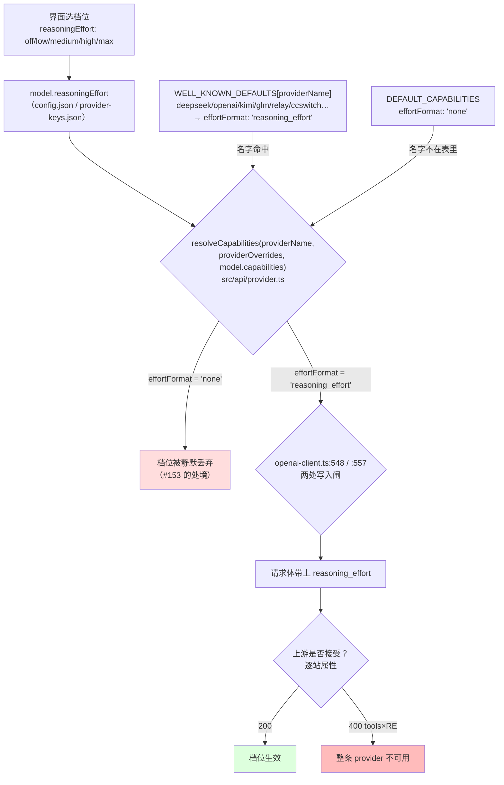

# reasoning_effort 通道：逐站属性，不能全局默认

> 结论先行：**该字段能不能发，是逐站属性**——实测存在一类中转站在带 `tools` 时硬拒它（400）。所以「把自建 provider 默认改成透传」会打死这类站；正确方向是**在 onboarding 探测期把兼容性学出来**，并在运行期用「剥字段重试」兜底——两者都是本仓已有范式。

## 实测证据（真机，非推演）

某 OpenAI 兼容中转站，暴露 `gpt-5.6-luna`。同一棵树、同一模型、同一 prompt，**只改 `capabilities` 一个变量**；出站请求体由本地抓包代理记录（`Authorization` 已脱敏）。

| 组 | `capabilities` | 出站请求体 `reasoning_effort` | HTTP |
|---|---|---|---|
| A | `{}`（现状） | **不存在** | **200 ×3**（CLI 每次正常回话） |
| B | `{ effortFormat: 'reasoning_effort' }` | `"high"` | **400** |
| C（去掉 `thinking`） | `{ effortFormat: 'reasoning_effort' }` | `"high"` | **400** |

B/C 的 400 原文：

```
Function tools with reasoning_effort are not supported for gpt-5.6-luna in /v1/chat/completions.
```

A 组抓包记录（三次连跑，确认稳定）：

```
model=gpt-5.6-luna  hasReasoningEffort=false  HTTP=200
model=gpt-5.6-luna  hasReasoningEffort=false  HTTP=200
model=gpt-5.6-luna  hasReasoningEffort=false  HTTP=200
```

两条由此确立的事实：

1. **#153 的前提线级成立**：自定义 provider 名下，模型带着 `reasoningEffort`，请求体里**就是没有该字段**——不报错、不提示。
2. **「盲透传」会打死整条 provider**：天枢每次请求都带 `tools`，所以在这类站上声明 `effortFormat` 等于把「静默丢弃」换成「每次 400」。盲透传比现状更坏。

### 边界（不外推）

- 单站点 / 单模型 / 单日。**不能推断"所有中转都拒绝"**，只能确立"存在这样一类站"。
- **去 tools 时该站是否接受该字段：无结论**。试了一次返回 `503 The model service is temporarily unavailable`——那是站点可用性错误，不是对该字段的裁定。
- **`thinking` 不是前置**：C 组与 B 组同样把字段发了出去，说明对 GPT 这类模型生效的是**请求级**那条分支，不依赖 `thinking: 'enabled'`。（`openai-client.ts:548` 与 `:557` 两处都以 `effortFormat` 为准，但 `:548` 那条嵌在 `thinking === 'enabled'` 内。）
- 复现时会踩的坑：模型列表**不在** `config.json` 的顶层 `models` 里，运行时读 `provider-keys.json`。手改顶层不生效。

## 数据流：档位从哪来、在哪被丢



现有 `effortChannelNotes`（PR #169）落在 `DROP` 那一格给出可见提示——它**不改变** `RELAY` 那一格的未知性。本方案要补的正是 `RELAY` 这一格：**在 onboarding 时问一次，运行时兜一次**。

## 备选方案与权衡

### A. 把自建 provider 的 `effortFormat` 默认改成 `'reasoning_effort'`

- 收益：档位真发得出去。
- 代价：**实测反例已出现**——这类站上每次请求 400，provider 完全不可用。天枢恒带 `tools`，所以这不是边缘情形。
- **排除。**

### B. 保留默认 + 让它可见（= PR #169 当前形态）

- 收益：零兼容风险；把「静默丢弃」变成「有说明的丢弃」，并已带反向告警（`91485ff`）。
- 代价：不解决「想让档位生效」这个原始诉求。
- **保留**（作为保底与兜底路径的提示层）。

### C. onboarding 探测期学习（推荐主路径）

在 `probeProvider` 的补全探测之外，加一次**变体探测**：带最小 `tools` 数组 + `reasoning_effort`，看是否 400。

- 落点：探测请求构造在 `src/api/provider-probe.ts:362-366`；结果并入 `CapabilityHints`（`provider-probe.ts:56`，现仅 `reasoningSplit`）；消费侧与 `reasoningSplit` 同路——`src/config/provider-cli.ts:143` 已经在把 hint 印成一行建议。
- 判定：400 且错误文本匹配 `reasoning_effort` → 记 `不支持（带 tools）`；200 → 记 `支持`；其它 → `未知`（不猜）。
- 收益：把「逐站属性」在**写配置之前**问出来，运行时不再有 400 惊喜；顺带让 `cmdAdd` 能给出正确建议而不是通用建议。
- 代价：probe 多花一次极小的请求（`max_tokens` 很小）。`--no-probe` 时跳过，能力退化为 B（**必须显式声明这个退化**）。

### D. 运行期自愈（推荐作为 C 的兜底）

`error-classifier` 新增一类：匹配 `reasoning_effort` 的「not supported」签名 → 返回一个 `stripReasoningEffort: true` 标志 → 调用侧剥掉该字段重试一次，并把结果记回能力存储。

- 先例：**同类范式仓里已有**——`src/api/error-classifier.ts:181`/`:459` 返回 `stripImages: true`，`:504` 有 `case 'image_strip'`，即「分类错误 → 置标志 → 剥字段重试」。
- 收益：C 的判定若因站点改版而失效，这里能自愈，而不是把用户钉在 400 上。
- 代价：一次浪费的请求（每次冷启动/每次变更是 1 次，不是每次请求）；需要一处「学到的能力」持久化。

### 推荐组合

**C 主 + D 兜底 + B 保底。** 三者互补：C 把未知变成已知，D 把已知的失效变成自愈，B 在无法探测（`--no-probe`）时保证至少不静默。

## 落点清单

| 位置 | 现状 | 改动 |
|---|---|---|
| `src/api/provider-probe.ts:362` | 补全探测请求 | 加一次「tools + reasoning_effort」变体探测 |
| `src/api/provider-probe.ts:56` | `CapabilityHints` 仅 `reasoningSplit` | 增 `reasoningEffortWithTools?: 'supported' \| 'rejected' \| 'unknown'` |
| `src/config/provider-cli.ts:143` | 把 `reasoningSplit` 印成一行 hint | 同路印出档位通道结论；`rejected` 时**不要**建议开 `effortFormat` |
| `src/config/provider-cli.ts` `effortChannelNotes` | PR #169 已加（含反向告警） | 若已知 `rejected`，提示改为「该站带 tools 拒绝该字段，建议不开」 |
| `src/api/error-classifier.ts:504` 附近 | `case 'image_strip'` | 加一类 `reasoning_effort_strip`，返回剥字段标志 |
| `src/api/openai-client.ts:548`/`:557` | 两处写入闸 | 剥字段重试路径复用同一处判断，不新增第三处 gate |
| 能力存储 | `provider-keys.json`（模型列表）/ `bandit:*`（会话态） | 需维护者定：学到的通道兼容性放哪 |

## 需要维护者定 / 未决

1. **学到的兼容性存哪**：`provider-keys.json`（随 provider 走，手改友好）还是新的 learned-state store（对齐 `bandit-promotion` 那套 shadow→gated 闸）？后者更"可审计"，前者更省事。
2. **probe 多花一次请求**是否可接受；`--no-probe` 时退化为 B，需在帮助文本里写明。
3. **桌面端仍看不到**：`src/server/provider-probe-adapter.ts` 刻意不透传 notes（注释写明"契约字段不含 notes"），所以 C/B 的结论在桌面端要么扩契约、要么落地到配置里由设置页展示。**不在本仓可单独解决**。
4. 是否把「档位通道」纳入 `GatedInfluenceSource` 那套效果档案（见 `docs/analysis/2026-09-17-cvm-mechanism-issues-premise-verification.md` 对 #170/#171 的讨论）——若纳入，本方案 C/D 的判定与"退役/降级"就有了统一表述。

## 反证（这份方案可能怎么被推翻）

- 若实测发现**绝大多数**中转站接受 `tools × reasoning_effort`，则 C 的成本（多一次探测 + 一处存储）就为一个小概率场景付账，方案 A 变体会重新变得有吸引力。当前我只有**一个站点**的反例，**不足以估计比例**。
- 若 D 的错误签名不稳定（不同站措辞不同），则 D 会漏判，只能退化为 B。当前签名来自一个站点的原文，**样本量为 1**。
- 若上游某天改成"静默忽略该字段"（而非 400），则 A 的代价消失、B 的价值同时下降——判定逻辑需要跟上游行为走，不能写死。

---
本文的实测部分（抓包矩阵、400 原文、边界）同时作为 [#153 的那条评论](https://github.com/huiliyi37/Tianshu-harness/issues/153#issuecomment-5713992531)的存档。
