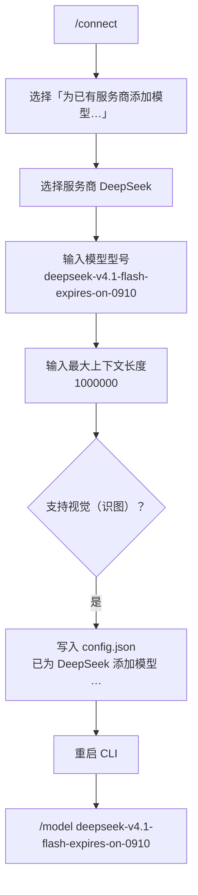

# 为已有服务商添加模型（/connect 加模型流程）

> 适用场景：某个服务商（如 DeepSeek）已经配好 API Key 与服务地址，只想**再挂一个模型**上去——不用重复填 URL 和密钥。
> 本文以在 CLI 端接入 DeepSeek 内测模型 `deepseek-v4.1-flash-expires-on-0910` 为例；同一套步骤适用于任意已配置服务商的任意模型。



---

## 前置条件

| 项 | 要求 |
|---|---|
| 服务商已配置 | DeepSeek 已通过 `/connect` 或 `rivet config setup deepseek --key-env DEEPSEEK_API_KEY` 配好——`/model list` 里能看到 DeepSeek |
| 账号权限 | 该 DeepSeek 账号已开通 / 受邀该内测模型的访问权限，否则调用会返回 404 / 无权访问 |
| CLI 版本 | tianshu-tui **v3.0.0 起**提供「为已有服务商添加模型」分支 |

> ⚠️ `deepseek-v4.1-flash-expires-on-0910` 是 DeepSeek 的**内测模型**，型号名里的 `expires-on-0910` 表示其可用期到 2026-09-10 前后。到期后该型号会失效，届时用同样步骤换挂一个新内测型号，或 `/model` 切回正式型号即可，不必删除配置。

---

## 交互式步骤

### 1. 打开 /connect 向导

在 CLI 对话框输入 `/connect` 回车，进入「连接模型服务商」页面。

### 2. 选择「为已有服务商添加模型…」

在服务商列表里往下移动到底部的 **`为已有服务商添加模型…`**（说明：*给已配置的服务商追加一个模型（不改动现有配置）*），回车。

> 这个分支只在**至少配置过一个服务商**后才会出现；一个都没有时先走一次正常的 `/connect` 流程。

### 3. 选择服务商 DeepSeek

标题为「为哪个服务商添加模型？」，选中 **DeepSeek** 回车。

### 4. 填写模型型号

标题为「输入模型型号」，输入：

```
deepseek-v4.1-flash-expires-on-0910
```

### 5. 填写最大上下文长度

标题为「模型最大上下文长度 (tokens)」，输入：

```
1000000
```

> 这个值决定自动压缩的触发点，务必照服务商官方 API 的真实值填：填小了会过早压缩（丢上下文、碎缓存），填大了会撞 API 上限来不及自救。DeepSeek V4 系列填 `1000000`。
>
> 注意：该步骤**回车会用默认值 `131072`**，要 1M 上下文必须手动输入 `1000000`。

### 6. 选择是否多模态

标题为「这个模型支持视觉（识图）吗？」，选 **是（多模态，可识图）**。

> 选「是」后该模型会进入「识图」配置的候选，可用来做识图桥；纯文本模型选「否」。选完即提交，界面提示 `已为 DeepSeek 添加模型 deepseek-v4.1-flash-expires-on-0910`。

### 7. 重启 CLI 并切换模型

回到对话框后**重启 CLI 端**，重新进入后执行：

```
/model deepseek-v4.1-flash-expires-on-0910
```

即完成接入。

> 向导结束时会顺带把新的 provider 表热加载进内存，多数情况下 `/model` 立刻可见；重启是保险做法——若 `/model list` 里没出现该型号，重启即可。

---

## 等价 CLI 命令（免交互）

同样的操作可以用一条命令完成，适合脚本 / 远程配置：

```bash
rivet config add-model deepseek deepseek-v4.1-flash-expires-on-0910 1000000 64000 --vision
```

参数依次为 `<服务商> <模型 ID> [上下文长度] [最大输出] [--vision]`；省略后两项时默认 `1000000` / `64000`，`--vision` 标记为可识图。

---

## 结果与校验

配置写入 `~/.rivet/config.json` 的 `provider.providers.deepseek.models`：

```json
{
  "provider": {
    "providers": {
      "deepseek": {
        "models": [
          {
            "id": "deepseek-v4.1-flash-expires-on-0910",
            "contextWindow": 1000000,
            "maxTokens": 64000,
            "supportsVision": true
          }
        ]
      }
    }
  }
}
```

- TUI 里 `/model list` 能看到 `deepseek-v4.1-flash-expires-on-0910`。
- 终端里 `rivet config providers` 可查看该 provider 下已登记的模型。

---

## 注意事项

- **内测模型有时效**：型号名带 `expires-on-0910`，到期后调用会失败；届时用 `/connect` 再挂一个新型号，或 `/model` 切回 `deepseek-v4-pro` / `deepseek-v4-flash`。
- **上下文长度是压缩阈值**：填 `1000000` 表示按 1M 窗口规划自动压缩点，不是「一定要用满 1M」。
- **最大输出默认 64000**：加模型分支不单独询问最大输出，落盘为 `min(64000, 上下文长度)`；要改可手编 `~/.rivet/config.json` 或用 `rivet config set-model`。
- **多模态只影响识图路由**：标记 `supportsVision` 不会让所有对话都走视觉，只是让它进入「识图」候选。

---

## 排障

| 现象 | 原因 / 处理 |
|---|---|
| 列表里没有「为已有服务商添加模型…」 | 还没有任何已配置的服务商——先走一次正常 `/connect` 配好 DeepSeek |
| `/model` 里看不到新型号 | 重启 CLI；仍看不到则 `rivet config providers` 确认是否写盘成功 |
| 调用报 404 / 无权访问 | 账号未开通该内测模型，或型号名拼错——照服务商控制台的准确型号名填 |
| 频繁触发上下文压缩 | 上下文长度填小了，改回 `1000000`（或该型号官方真实值） |

---

## 参考

- [模型提供商配置指南](../user-guide-provider-config.md)
- Provider 预设源码：`src/config/provider-presets.ts`
- 加模型向导源码：`src/tui/connect-flow.ts`（`add-model` 分支）
