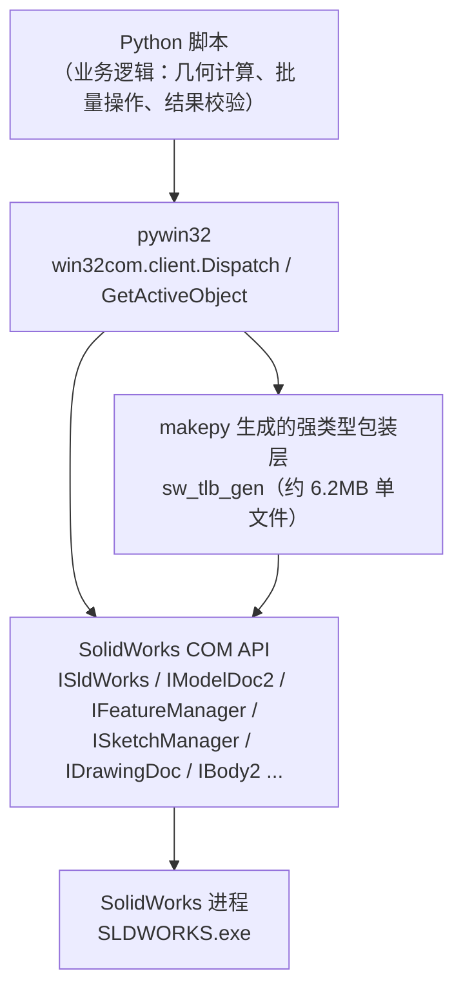
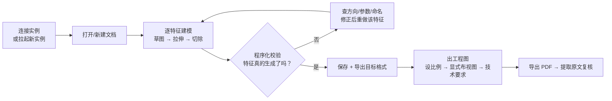

# SolidWorks 程序化接入总结

> 记录时间：2026-09-16
> 主题：如何用程序（Python）接入 SolidWorks，以及接入过程中遇到的问题与解决方案
> 性质：技术复盘 —— 只记录**接入要点**与**问题解法**，供后续复用

---

## 一、接入目标

不用鼠标在 SolidWorks 图形界面里点选建模，而是**用程序直接驱动**它完成：新建文档 → 建模（拉伸/切除等特征）→ 结果校验 → 出工程图 → 导出其他格式。

这样做的价值：建模过程可脚本化、可复用、可批量；每一步都能用程序化的判据验收，而不是靠肉眼确认。

---

## 二、接入方式

### 2.1 三层架构



**核心结论**：裸 `win32com` 的动态派发（late binding）**不够用**——大量 API 会因为参数类型问题失败（见第四节 B 类）。必须叠加第三层：用 `makepy` 从 SolidWorks 类型库生成强类型包装，再手动包裹 COM 对象。**这是整套方案能跑通的前提，不是可选项。**

### 2.2 环境事实（实测采集）

| 项目 | 值 |
|---|---|
| SolidWorks 版本 | `33.5.0`（= SOLIDWORKS Premium 2025 SP5.0） |
| 安装路径 | `<SW安装目录>\SLDWORKS.exe` |
| COM ProgID | `SldWorks.Application` |
| COM CLSID | `{6af263bb-eb9f-4176-89e9-4f892eb0ca3d}` |
| 类型库 | `<SW安装目录>\sldworks.tlb`（约 2.0 MB） |
| Python | 3.10.9 |
| pywin32 | 312 |
| PyMuPDF | 1.28.2（用于校验导出的 PDF） |
| 零件模板 | `C:\ProgramData\SolidWorks\SOLIDWORKS 2025\templates\gb_part.prtdot` |
| 工程图模板 | 同目录 `gb_a3.drwdot`（国标 A3） |
| 材质库 | `<SW安装目录>\...\sldmaterials\solidworks materials.sldmat` |

**无文档时如何自查这些信息**：

1. 注册表找 COM 注册：`reg query "HKLM\SOFTWARE\Classes\SldWorks.Application\CLSID"`
2. 由 CLSID 反查可执行文件：`reg query "HKLM\SOFTWARE\Classes\CLSID\{...}\LocalServer32"` → 得到 `SLDWORKS.exe` 完整路径
3. 由可执行文件所在目录定位类型库 `sldworks.tlb`、模板目录、材质库

### 2.3 最短可用路径（从零到能跑）

```python
# 1) 生成强类型包装模块（只需做一次，之后可反复复用）
import sys
sys.argv = ['makepy', '-o', r'<输出路径>', r'<SW安装目录>\sldworks.tlb']
import win32com.client.makepy as makepy
makepy.main()      # 产出：一个【无扩展名】的单文件（约 6.2MB）
```

```python
# 2) 加载该模块（它没有 .py 扩展名，不能直接 import）
import sys
GEN = r"<输出路径>"
src = open(GEN, "r", encoding="mbcs").read()       # 注意编码是 mbcs
sw_tlb = type(sys)("sw_tlb")
exec(compile(src, GEN, "exec"), sw_tlb.__dict__)
```

```python
# 3) 连接 SolidWorks（含"进程已被关掉"的兜底）
import win32com.client, time
try:
    sw = win32com.client.GetActiveObject("SldWorks.Application")
except Exception:
    sw = win32com.client.Dispatch("SldWorks.Application")
S = sw_tlb.ISldWorks(sw._oleobj_)
for _ in range(90):                     # 轮询等启动就绪
    try: S.RevisionNumber(); break
    except Exception: time.sleep(2)
sw.Visible = False                      # 静默运行，不打扰桌面
sw.UserControl = True                   # 脚本退出后不杀进程
```

```python
# 4) 所有对象都要"包一层"才能安全调用 API
W   = sw_tlb.IModelDoc2(doc._oleobj_)
ext = sw_tlb.IModelDocExtension(doc.Extension._oleobj_)
sk  = sw_tlb.ISketchManager(W.SketchManager._oleobj_)
fm  = sw_tlb.IFeatureManager(W.FeatureManager._oleobj_)
# 连 API 返回的 dispatch 也要再包：IFeature(f._oleobj_)
```

---

## 三、典型调用流程



**贯穿全程的一条原则**：每个特征做完立刻校验，而不是等全部做完再看结果。下面的 D-4、D-8 两个问题正是靠这条原则抓出来的。

---

## 四、问题清单

按层次分类，每条给出：**现象 → 根因 → 解法**。共 33 条。

### A 类：连接与实例层

| # | 现象 | 根因 | 解法 |
|---|---|---|---|
| A-1 | PowerShell `New-Object -ComObject SldWorks.Application` 报 `0x8002802B (TYPE_E_ELEMENTNOTFOUND)`；`[Activator]::CreateInstance` 同样失败 | PowerShell 的 COM 绑定对 SolidWorks 这种重型 IDispatch 对象支持不佳 | **改用 Python + pywin32**（`win32com.client.Dispatch` 一次成功）。结论：这不是环境问题，是调用方式问题 |
| A-2 | `sw.RevisionNumber()` 报 `'str' object is not callable` | 动态派发下，`RevisionNumber` 被解析为**属性**而非方法 | 按属性取：`sw.RevisionNumber` → 得到 `'33.5.0'`。同类：`GetTitle`/`GetType`/`Name`/`GetTypeName2` 在不同包装下可能是属性也可能是方法，需实测 |
| A-3 | `doc.GetHWnd()` 报 `AttributeError`（动态派发下不可见） | 部分 API 在动态派发下不可见 | 需要窗口句柄时改走 **Win32 独立通道**（`EnumWindows` 按标题查找），反而更可靠 |
| A-4 | 脚本中途连不上：`GetActiveObject` 报"操作无法使用" | SolidWorks 进程已被关闭 | 固定加兜底：`GetActiveObject` 失败 → `Dispatch` 新实例 → **轮询等就绪**（`RevisionNumber` 成功为止，最多 90×2 秒） |
| A-5 | 遍历打开文档列表时整脚本崩溃：`对象已与其客户端断开连接` | 返回的 dispatch 指针可能已失效 | 遍历必须 **try/except 跳过**，不能假设列表里每个对象都有效 |
| A-6 | `S.ActivateDoc3(标题, False, 0, 0)` 静默失败（活动文档没切换） | 第 4 个参数 `Errors` 是 **byref long**，传 int 会类型不匹配并被吞掉 | 改用确定性路径：**先关掉所有文档，只打开需要操作的那一个**，它自然是活动文档 |
| A-7 | `OpenDoc6(...)` 的返回值用 `._oleobj_` 报 `'tuple' object has no attribute` | 强类型包装下，out 参数被并入返回值：`(doc, errs, warns)` | 统一取 `r[0] if isinstance(r, tuple) else r` |
| A-8 | `ext.SaveAs(path, 0, 1, None, 0, 0)` 报"类型不匹配" | `Errors/Warnings` 是 `VT_BYREF\|VT_I4`，`ExportData` 是 `VT_DISPATCH`，显式构造 VARIANT 也难成功 | 改用 **`IModelDoc2.SaveAs3(path, 0, 1)`**（无 byref 参数）。注意它返回 0 也可能已成功落盘，**以文件实际存在+大小为准** |

### B 类：类型绑定层（最大的坑）

| # | 现象 | 根因 | 解法 |
|---|---|---|---|
| B-1 | **核心难题**：`ext.SelectByID2(name, "PLANE", x,y,z, False, 0, None, 0)` 始终报 `(-2147352571, '类型不匹配', None, 8)`；试过 `None` / `VT_NULL` / `VT_BYREF\|VT_EMPTY` / `VT_ARRAY` / `VT_PTR` 全部失败 | 类型库里 `Callout` 参数声明为 `(9, 1)` = **VT_DISPATCH + IN**；动态派发无法正确构造这个参数 | **用 makepy 生成强类型包装**，再把 COM 对象包进生成的接口类：<br/>`sw_tlb.IModelDocExtension(ext._oleobj_).SelectByID2(...)` → 立即可用 |
| B-2 | 包装后子对象的方法仍报"找不到成员" | 生成类只包装了顶层对象，**API 返回的子对象仍是裸 dispatch** | 每个返回值都要再包：<br/>`feat = sw_tlb.IFeature(feat_ole._oleobj_)` |
| B-3 | makepy 产物 `import` 失败（`'NoneType' object has no attribute 'loader'`） | 生成的文件**没有扩展名**，import 机制不认 | 用 `exec(compile(src, GEN, "exec"), ns)` 方式加载；文件编码为 `mbcs` |
| B-4 | `CreateCircleByRadius(x, y, r)` 报"类型不匹配" | 类型库里是 **4 个参数** `(XC, YC, Zc, Radius)` | 传 4 参：`sk.CreateCircleByRadius(x, y, 0, r)` |
| B-5 | `FeatureCut4` 报"类型不匹配"，错误位置指向参数索引 | 该函数 **27 个参数**，少传即报错 | 参数必须逐个填满（见附录签名）。**错误信息里的索引号是定位线索**，别忽略 |
| B-6 | `mp.Volume` 有时是值、有时是方法 | 不同版本的 typelib 声明不一致 | 兼容写法：`v = mp.Volume() if callable(mp.Volume) else mp.Volume` |

### C 类：命名与本地化层

| # | 现象 | 根因 | 解法 |
|---|---|---|---|
| C-1 | 用 `"Front Plane"` 选基准面返回 `False`（**不报错，只是选不中**——最难查的一类） | 中文版 SolidWorks 的特征名是**中文** | 用真实名：`前视基准面` / `上视基准面` / `右视基准面`；草图与特征名同理（`草图1`、`凸台-拉伸1`、`切除-拉伸1`）。**查名方法**：遍历特征树打印 `GetTypeName2()` + `Name` |
| C-2 | `CreateDrawViewFromModelView3(模型名, "*Front", x, y, 0)` 返回 `None`（静默失败） | 命名视图在中文版里也是中文 | 用 `IModelDoc2.GetModelViewNames()` 读出真名：`('*正视于','*前视','*后视','*左视','*右视','*上视','*下视','*等轴测','*上下二等角轴测','*左右二等角轴测')` |
| C-3 | 设置材质：`pd.SetMaterialPropertyName2("", "SOLIDWORKS 材质", "<库中材质名>")` 不报错但不生效 | 材质库名是**完整路径**，且材质名必须与库中完全一致 | ① `S.GetMaterialDatabases()` 取库的完整路径；② 直接解析 `.sldmat` 文件（XML 文本，注意编码）列出真实材质名；③ 设完**必须回读校验**：`pd.GetMaterialPropertyName2("", DB)` |

### D 类：几何建模 API 层

| # | 现象 | 根因 | 解法 |
|---|---|---|---|
| D-1 | `FeatureExtrusion2` 报"类型不匹配" | 参数个数不对（23 个） | 补齐参数，见附录签名 |
| D-2 | 拉伸出的厚度只有预期的一半 | `Dir` 参数语义理解错：`Sd=True, Dir=True` 是"单向 + 方向2"，**不是对称拉伸** | 正确组合：**`Sd=False, Flip=False, Dir=True, D1=D2=半厚`** |
| D-3 | 切除特征返回 `None`（失败） | `Flip` 方向与材料方向不匹配 | 写"**试错 + 校验**"循环：先按一个方向切，用体积变化判断是否成功，失败则翻转重试 |
| D-4 | 特征"成功"了，但结果尺寸不对 | —— | **靠数值恒等式抓出来**（见 5.2）：实测体积与理论值**正好差一倍**，立刻定位到拉伸参数语义问题 |
| D-5 | 想要"完全贯穿"的孔，传 `T1=1 (ThroughAll)` 反而返回 `None` | 该枚举组合在当前上下文不生效 | 改用"**双向大深度**"等价实现：`Dir=True, D1=D2=0.030`（远大于工件厚度）→ 稳定贯穿 |
| D-6 | `doc.GetBox()` 不存在 | `GetBox` 不在 `IModelDoc2` 上 | 走 `IPartDoc.GetBodies2(-1, False)` → `IBody2.GetBodyBox()`（返回 6 个坐标值，单位米） |
| D-7 | 质量属性读数不对 | `CreateMassProperty` 未更新到最新状态 | 体积读数可直接用；质量需注意 `UpdateMassProperties` 在不同版本的可调用性，必要时以"体积 × 密度"自行核算 |
| D-8 | **90° 锥形沉孔做不出来**（两个方案都失败） | ① `FeatureCut4` 带拔模（`Dchk1=True + Ddir1 + Dang1=45°`）**恒返回 None**；② `InsertFeatureChamfer` 返回非 None 的特征，但**体积变化为 0、锥面数为 0**（几何根本没生成），`ChamferType` 试 0/1/2/3 都一样 | **绕行**：改做**柱形沉孔**（平底圆柱凹台），走已验证可用的"面上画圆 + 给定深度切除"路径 → 一次成功。<br/>若设计上必须用 90° 锥形沉孔，则**在图纸技术要求里写明**由加工方用锥形锪钻完成 |

### E 类：工程图 API 层

| # | 现象 | 根因 | 解法 |
|---|---|---|---|
| E-1 | 自动布图接口 `Create1stAngleViews` 生成的图纸一片空白 | 1:1 的视图尺寸超出图纸幅面，且横向中心落在纸边之外 | 先设图纸比例：`ISheet.SetScale(1, 2, False, 0.003)`，**再**创建视图（视图继承图纸比例） |
| E-2 | `IDrawingDoc.SetSheetScale(...)` 报属性不存在 | 强类型包装下该接口未暴露此方法 | 用 `ISheet.SetScale(分子, 分母, 标注位置, 标注字高)`，返回 `True` 即成功 |
| E-3 | `IView.Position = (x, y)` 行为诡异：改一个视图会让**整组平移**，且传入坐标与回读值对不上 | setter 语义与直觉不符（用两步受控实验确认：设 x 却改变 y、设一个视图却整组位移） | **弃用 Position setter**，改用 `IDrawingDoc.CreateDrawViewFromModelView3(模型名, 视图名, X, Y, Z)` **创建时就显式指定位置**，一次到位 |
| E-4 | 视图位置对不对，肉眼无法判断 | —— | 用 `IView.GetOutline()` 取包围盒，**程序化核验**：`0 ≤ x ≤ 纸宽`、`0 ≤ y ≤ 纸高`，越界立刻能抓出 |
| E-5 | 模型尺寸没有自动出现在图纸上 | 未调用标注接口 | `IDrawingDoc.InsertModelAnnotations(1, 3, False, False)` |
| E-6 | **`InsertNote` 插入的技术要求被截断**：一次插 10 行时，最后一条整条丢失、倒数第二条结尾被切 | 该 API 对文字量有限制 | **拆成多段注释**（每段 3–5 行）。验证方法：从导出的 PDF 里**提取原文逐条核对**（`pymupdf` 的 `get_text()`），不靠肉眼看渲染图 |
| E-7 | 两段注释插进去后**互相压字，还压在一个视图上** | `InsertNote` 的默认落点是固定的，不管周围有没有内容 | ① 枚举注解：`IView.GetFirstAnnotation3()` → `IAnnotation.GetNext3()`；<br/>② 按内容识别：`GetType()==6`（Note）+ `GetSpecificAnnotation()`→`INote.GetText()`；<br/>③ 挪位：`IAnnotation.SetPosition(x, y, z)`；<br/>④ 复核：用 PDF 文字块的坐标做**程序化重叠检测**（注释块 vs 各视图矩形、注释块互检） |
| E-8 | 想导出 PNG 给用户看，结果导成"图纸图框" | `ext.SaveAs` 导出的是**当前活动窗口**的视图 | 先确保目标文档是活动文档（最可靠做法：**关掉其它文档，只开目标**），再 `ShowNamedView2` + `SaveAs` |

### F 类：无法解决 / 留待后续

| 项 | 状态 | 替代方案 |
|---|---|---|
| 90° 锥形沉孔建模 | ❌ 未能实现 | 改用柱形沉孔（配相应头型的紧固件）；或图纸技术要求注明锥形沉孔加工由加工方完成 |
| `IView.Position` 精确排布 | ⚠️ 已绕开 | 创建视图时就给定坐标（E-3） |
| 质量属性自动化更新 | ⚠️ 未深究 | 通过正确设置材质解决（材质正确后重量自动正确） |

---

## 五、如何确认 API 调用真的生效

SolidWorks API 有两种失败：**报错的**（好查）和**不报错的**（返回 `None`/`False` 但原因不明）。后者才是真正的陷阱——本工程多数难查问题都属于后者。

### 5.1 手段阶梯

遇到 API 失败时按此顺序升级，不要反复试同一个调用：

1. **读类型库签名** —— 从生成的包装模块里 `grep` 函数定义，拿到**准确参数个数与类型**（第 N 个参数是 `(5,1)` 还是 `(9,1)`）。B-1/B-4/B-5 都是这样破的
2. **看错误里的参数索引** —— `'类型不匹配', None, 8` 的 `8` 指向第 8 个参数，比盲试快得多
3. **静默失败要换判据** —— 返回 `None`/`False` 却不报错时（C-1/C-2/E-8），改用"枚举真实名字"或"回读实际状态"来定位
4. **两步受控实验** —— `IView.Position` 的诡异行为，就是靠"只改 x 看结果、只改 y 看结果"两个数据点定性出来的
5. **换独立通道** —— COM 说不清的事，用 Win32 API 或第三方库另起一路取证（见 5.4）

### 5.2 数值恒等式（验证几何特征是否真的生成）

每做完一步拉伸/切除，立刻核算：

```
理论结果 = 毛坯量 − Σ(每个特征的理论去除量)
比较：SolidWorks 实测值  与  理论值
```

**这招的价值**：把"看起来对"变成"算得对"，而且能**精确定位到是哪一步出的错**——只要每步都算，出错那一步立刻暴露。

本工程用它抓到的问题：
- D-2：拉伸厚度只有预期一半（实测值与理论值正好差一倍）
- D-8：沉孔没生效（附加去除量为 0，而理论值非零）
- 最终验收：实测与理论 **diff 0.00**

### 5.3 逐面几何审计（数清几何要素最可靠的方法）

想知道模型里到底有几个孔、什么规格、是否贯穿——不要靠眼睛数，遍历每个面：

```python
b2 = IPartDoc(doc).GetBodies2(-1, False)[0]
for f in b2.GetFaces():
    surf = f.GetSurface()
    if surf.IsCylinder():
        radius = surf.CylinderParams[6]     # 注意：是属性，不是方法
        # 用半径分类统计（各类孔的半径不同，可按半径归桶计数）
    z_span = 面自身包围盒的 Z 跨度          # 与工件厚度比较即可判断贯穿/盲孔
```

**两个坑**：
- `CylinderParams` 是**属性**不是方法（写成 `CylinderParams()` 会报 `'tuple' object is not callable`）
- 一个孔位可能对应**多个面**（如"沉孔 + 通孔"= 2 个圆柱面），判"是否贯穿"要**按孔位合并所有面的 Z 范围**后再比较，否则会把带沉孔的贯穿孔误判为盲孔

### 5.4 独立通道取证（不轻信单一来源）

| 要验证的事 | 不要只看 | 应该用 |
|---|---|---|
| 窗口真的显示在屏幕上 | SolidWorks 自报 `Visible=True` | Win32 `EnumWindows` + `IsWindowVisible` 枚举实际可见窗口，比对窗口标题 |
| 图纸内容完整 | 渲染图的视觉识别（对中文小字不可靠） | PDF 文字层**原文提取**（`pymupdf.get_text()`）逐条核对 |
| 图纸元素不重叠 | 肉眼看 | PDF 文字块**坐标**与视图包围盒做程序化求交 |
| 文件真的保存了 | API 的返回值（`SaveAs3` 返回 0 也可能是成功） | 检查文件是否**存在 + 大小 + mtime** |

**教训**：本工程中，视觉模型对图纸小字的转写多次出错（读错符号、条与条之间读串）；而 PDF 原文提取和坐标比对给出的结论与后续核验完全一致。**判据要选可信的那种。**

---

## 六、可复用骨架

```python
# ============ 通用头部：加载类型库 + 连接 SW ============
import sys, io, time
sys.stdout = io.TextIOWrapper(sys.stdout.buffer, encoding="utf-8", errors="replace")
import win32com.client

GEN = r"<makepy 输出路径>"          # 一次生成，长期复用
src = open(GEN, "r", encoding="mbcs").read()
sw_tlb = type(sys)("sw_tlb")
exec(compile(src, GEN, "exec"), sw_tlb.__dict__)

try:
    sw = win32com.client.GetActiveObject("SldWorks.Application")
except Exception:
    sw = win32com.client.Dispatch("SldWorks.Application")
S = sw_tlb.ISldWorks(sw._oleobj_)
for _ in range(90):
    try: S.RevisionNumber(); break
    except Exception: time.sleep(2)
sw.Visible = False; sw.UserControl = True

# ============ 包装与工具函数 ============
def wrap(doc):
    """把文档对象拆成强类型包装的各个接口（每个都要包 _oleobj_）"""
    W   = sw_tlb.IModelDoc2(doc._oleobj_)
    ext = sw_tlb.IModelDocExtension(doc.Extension._oleobj_)
    sk  = sw_tlb.ISketchManager(W.SketchManager._oleobj_)
    fm  = sw_tlb.IFeatureManager(W.FeatureManager._oleobj_)
    pd  = sw_tlb.IPartDoc(doc._oleobj_)
    return W, ext, sk, fm, pd

def open_doc(path, doctype):        # doctype: 1=零件 3=工程图
    errs = 0
    r = S.OpenDoc6(path, doctype, 0, "", errs, 0)
    return r[0] if isinstance(r, tuple) else r

def volume_mm3(ext):
    mp = ext.CreateMassProperty()
    v = mp.Volume() if callable(mp.Volume) else mp.Volume
    return v * 1e9

def bbox_mm(pd):
    b = sw_tlb.IBody2(pd.GetBodies2(-1, False)[0]._oleobj_).GetBodyBox()
    return [round((b[i+3]-b[i])*1000, 2) for i in range(3)]

def cut(W, ext, sk, fm, circles, face_xyz, sketch_name, depth=None):
    """在指定面上画圆并切除；depth=None 表示双向大深度等效贯穿
    用法：W, ext, sk, fm, pd = wrap(doc)
         cut(W, ext, sk, fm, [(x, y, r), ...], (fx, fy, fz), "草图2", depth=0.012)"""
    W.ClearSelection2(True)
    assert ext.SelectByID2("", "FACE", *face_xyz, False, 0, None, 0), "face not found"
    sk.InsertSketch(True)
    for (x, y, r) in circles:
        sk.CreateCircleByRadius(x, y, 0, r)     # 注意 4 个参数
    sk.InsertSketch(True)                        # 退出草图
    W.ClearSelection2(True)
    assert ext.SelectByID2(sketch_name, "SKETCH", 0, 0, 0, False, 0, None, 0)
    d1, dirn = (0.030, True) if depth is None else (depth, False)
    return fm.FeatureCut4(False, False, dirn, 0, 0, d1, d1,
                          False, False, False, False, False, False,
                          False, False, False, False,
                          False, False, True,
                          False, False, False, 0, 0.0, False, False)
```

---

## 七、关键 API 签名速查

```
ISldWorks
  RevisionNumber                     # 属性，返回 '33.5.0'
  GetDocuments()                     # 返回 dispatch 数组（可能含失效指针，需 try/except）
  OpenDoc6(Path, Type, Options, Cfg, out Errs, out Warns)
                                     # Type: 1=零件 3=工程图；强类型下返回 (doc, errs, warns)
  CloseDoc(Title)
  GetMaterialDatabases()             # 返回材质库完整路径

IModelDoc2
  GetTitle() / GetType() / ClearSelection2(True)
  FirstFeature() -> GetNextFeature() # 遍历特征树
  EditRebuild3() / ViewZoomtofit2() / ShowNamedView2(名, id)
  GetModelViewNames()                # 命名视图列表（中文版为中文名）
  SaveAs3(Path, Version, Options)    # 无 byref 参数，优于 Extension.SaveAs
  InsertNote(Text)                   # 有文字量限制，长文本要拆分

IModelDocExtension
  SelectByID2(Name, Type, X, Y, Z, Append, Mark, Callout, Option)
                                     # ★ 必须配合强类型包装调用
                                     # Type: "PLANE"/"FACE"/"EDGE"/"SKETCH"/"BODYFEATURE"
  CreateMassProperty() -> MassProperty
  SaveAs(Name, Version, Options, ExportData, out Errors, out Warnings)

ISketchManager
  InsertSketch(True)                 # 进入/退出草图切换
  CreateCornerRectangle(x1,y1,z1, x2,y2,z2)
  CreateCircleByRadius(XC, YC, Zc, Radius)      # ★ 4 个参数

IFeatureManager
  FeatureExtrusion2(Sd, Flip, Dir, T1, T2, D1, D2, Dchk1, Dchk2, Ddir1, Ddir2,
                    Dang1, Dang2, OffRev1, OffRev2, Transl1, Transl2, Merge,
                    UseFeatScope, UseAutoSelect, T0, StartOffset, FlipStartOffset)
                    # 23 参数；对称拉伸：Sd=False, Dir=True, D1=D2=半厚
  FeatureCut4(Sd, Flip, Dir, T1, T2, D1, D2, Dchk1, Dchk2, Ddir1, Ddir2,
              Dang1, Dang2, OffRev1, OffRev2, Transl1, Transl2, NormalCut,
              UseFeatScope, UseAutoSelect, AsmFeatScope, AutoSelectComps,
              PropagateToParts, T0, StartOffset, FlipStartOffset, OptimizeGeometry)
              # 27 参数；拔模沉孔不可用
  InsertFeatureChamfer(Options, Type, Width, Angle, OtherDist, V1, V2, V3)
              # ⚠️ 实测返回特征但几何不生效，勿依赖

IPartDoc
  GetBodies2(-1, False) -> 实体数组
  GetMaterialPropertyName2(Config, Database)     # 读材质（需回读校验）
  SetMaterialPropertyName2(Config, Database, Name)

IBody2
  GetBodyBox()                       # 6 值：xmin,ymin,zmin,xmax,ymax,zmax（米）
  GetFaces() -> 面数组

ISurface
  IsCylinder() / IsCone() / IsPlane()
  CylinderParams                     # ★ 属性（不是方法）；[6] = 半径（米）

IDrawingDoc
  GetFirstView() -> IView
  CreateDrawViewFromModelView3(ModelName, ViewName, X, Y, Z)   # ★ 显式定位
  InsertModelAnnotations(1, 3, False, False)
  Create1stAngleViews2(ModelPath)    # 自动布图（易越界，需校验）

ISheet
  SetScale(分子, 分母, 标注位置, 标注字高)      # ★ 设图纸比例的可靠入口

IView
  GetOutline() -> (x1,y1,x2,y2)（米）
  GetFirstAnnotation3() -> IAnnotation -> GetNext3()
  Position                           # ⚠️ setter 语义诡异，勿用

IAnnotation
  GetType()                          # 6 = Note
  GetSpecificAnnotation() -> INote
  SetPosition(X, Y, Z)               # 挪位有效
```

---

## 八、结论与建议

**接入是可复用的**。核心就三件事：
1. 用 `makepy` 生成强类型包装（省不得）
2. 所有 COM 对象（含 API 返回值）都包一层
3. 中文版的名字要用真实中文名——**用接口查**（`GetModelViewNames()`、遍历特征树），而不是猜

**最大的教训是"静默失败"**。报错的失败好查（错误里的参数索引能直接定位）；不报错的失败只能靠：
- 枚举真实名字（C-1、C-2）
- 回读实际状态（A-8、E-6）
- 用可计算的判据替代肉眼判断（5.2/5.3/5.4）

**验证宁可多花 10 秒**。每个特征后核算一次，动作很轻，但正是它抓出了"尺寸只有一半""特征没真正生成"这两类肉眼难以发现的问题。相对地，靠渲染图肉眼核对的尝试被证明**不可靠**。

**已知边界**：90° 锥形沉孔、`IView.Position` 精确排布、质量属性自动更新三项未能完全走通，已在第四节 F 类记录替代方案。

**下次做同类工作**：直接复用 makepy 生成的包装模块和第六节骨架，从零到第一个特征只需几分钟；把时间花在设计与计算上，而不是重新踩这些 API 的坑。
