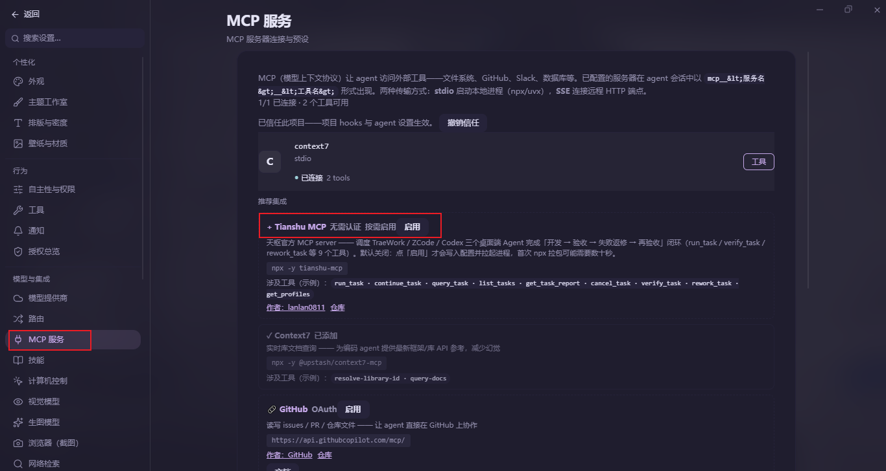
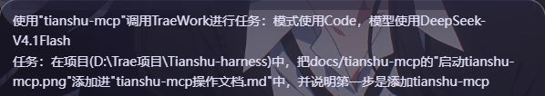
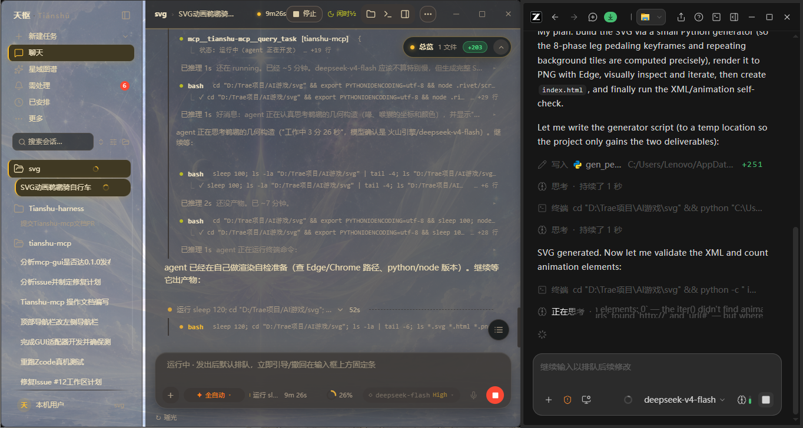

# tianshu-mcp操作文档

- 开发者：[lanlan0811](https://github.com/lanlan0811)
- 仓库：[lanlan0811/tianshu-mcp](https://github.com/lanlan0811/tianshu-mcp)

## 第一步：添加 tianshu-mcp

打开 **设置 → MCP 服务**，在「推荐集成」区域找到 **Tianshu MCP**（作者：lanlan0811），点击右侧的「**启用**」按钮。默认处于关闭状态，点击启用后才会写入配置并拉起进程；首次经由 npx 拉取包可能需要数十秒。



## 第二步：使用 tianshu-mcp

启用后，在与天枢的对话里直接用自然语言交代任务即可——一句话说明要调用的外部 Agent（TraeWork / Codex / ZCode）、使用的模式与模型，以及任务本身。天枢会经 tianshu-mcp 的 `run_task` 把任务派发出去，随后自动验收；不通过则返修再验，直到收敛。

例如：使用 tianshu-mcp 调用 TraeWork 进行任务，模式使用 Code、模型使用 DeepSeek-V4.1Flash；任务是在指定项目里完成某个改动。



## 第三步：mcp 正在调用 Agent 工作

`run_task` 秒回 taskId 后，天枢不会干等——它经 `query_task` 持续轮询任务进展。状态显示为「运行中（agent 正在开发）」，被调起的 Agent（此例为 TraeWork，Code 模式 / deepseek-v4-flash）在自己的窗口里实际读代码、改文件、跑命令。

这一步你需要做的只是看着：中途可以继续输入去引导或撤回，不打断当前运行；等 Agent 交付后，天枢会自动进入验收——通过则收工，不通过则把失败摘要回填给它返修，再验收。



## 可调用的 Agent

`run_task` 的 `agentId` 决定把任务派给哪个外部 Agent，**省略时为 `codex`**。下面 7 个是内置 profile（`builtin.ts` 注册），Windows 真机探测全部通过：

| agentId | 名称 | 适合什么任务 | 专属参数 |
|---|---|---|---|
| `codex` | Codex（ChatGPT 桌面端 GUI） | 通用编码；可挂计划文档与设计系统 | `model` · `reasoningLevel`（低/中/高） · `planDoc` · `designSystem` |
| `traework` | TraeWork（TRAE SOLO CN） | 需要切换面板模式 | `model` · `mode`（Work·Code·Design） |
| `zcode` | Zcode（ZCode 桌面） | 唯一支持无项目派发（新建空工作区） | `model`（**必填**） · `reasoningLevel` · `allowCreateProject` |
| `kimicode` | Kimi Code | 以工作区（会话文件夹）组织的任务 | `model` · `reasoningLevel`（官方模型 低/高/max；非官方 开/关） |
| `qoder` | Qoder CN | 已有项目 + 计划文档的定向开发 | `planDoc`（**必填**） · `modelSource`（default·custom） · `reasoningLevel` |
| `opendesign` | Open Design | 设计类产出 | `designDirection`（**必填**：原型·文档·网站复刻） · `model` |
| `minimax` | MiniMax Code | 需指定上下文窗口的长上下文任务 | `model` · `contextWindow` · `reasoningLevel` |

换一个 `agentId`，其余写法不变：

```
run_task(projectPath="D:/xxx/my-app", task="…任务书…", agentId="traework", mode="Code", model="GLM-5.3", autoVerify=true)
```

几条边界（均有代码依据，写错会在派发入口直接报错，不会静默降级）：

- **专属参数不可混用**：`mode` 仅 TraeWork；`designDirection` 仅 Open Design；`contextWindow` 仅 MiniMax Code；`modelSource` 仅 Qoder CN；`allowCreateProject` 仅 ZCode。传给其他 agent 会被明确拒绝。
- **`mode` 不传时**从任务书文本自动识别；`agentId` 为 TraeWork 以外的值传入 `mode` 直接报错。
- **`reasoningLevel` 的合法档位随 agent 与模型而变**，传入界面不存在的档位会在**发送前**报错。
- **除 `zcode` 外都必须提供 `projectPath`**；`qoder` 额外要求一份可读的 `planDoc`。
- **`model` 对 spawn 类 agent 不生效**；GUI 类 agent 由适配器在发任务前切换模型。
- **平台**：上表结论来自 Windows 真机；macOS 真机验证未完整，部分 agent 会直接拒绝派发——以 `get_profiles` 的实时探测结果为准。

> 想接自己的 agent 不必改代码：在数据目录的 `agent-profiles.json` 里加一个 profile 即可，字段说明见 tianshu-mcp 仓库的 `docs/agent-profiles.md`。
